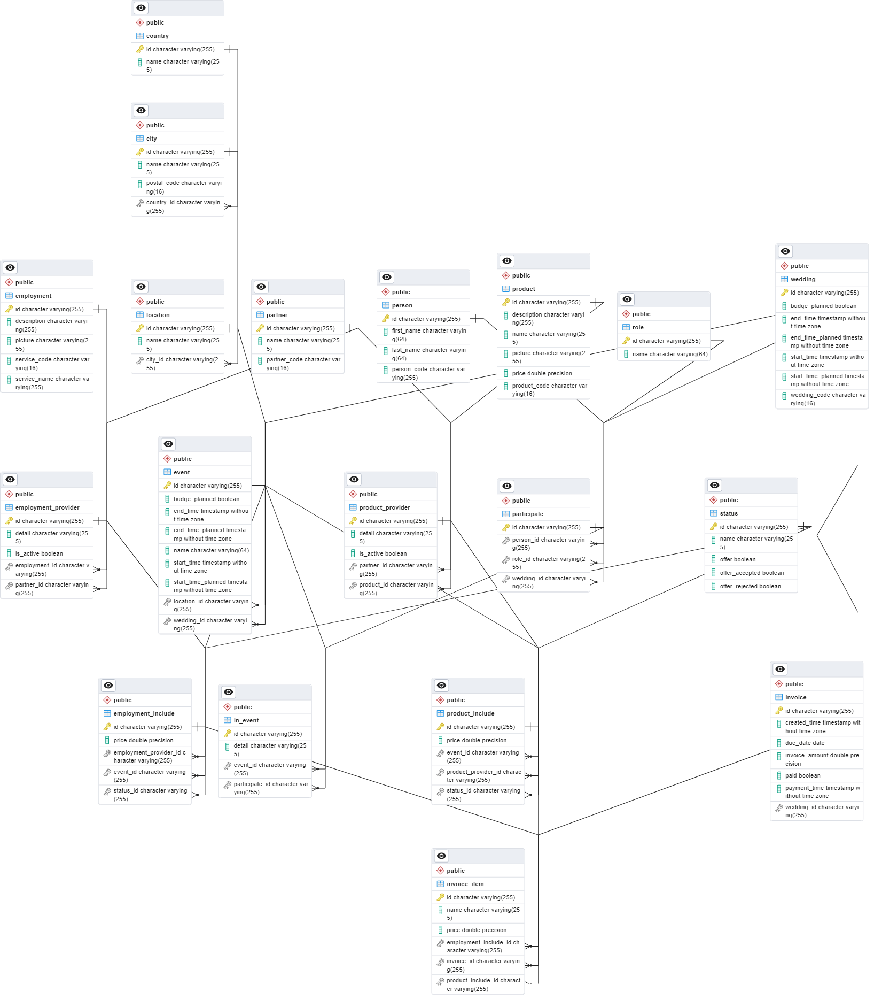

# Wedding Organization Company System

## Description

This is Wedding Organization Company System. 

## Getting Started

### Prerequisites

* Java 17
* Maven
* Docker
* Postgres

### Installing

* Clone the repository
* Open the project in your favorite IDE
* Run `mvn clean install` to build the project
* Create a database named `WeddingOrganizationCompany` in Postgres

## Entity Classes

### Employment

- id string
- service_code string(16)
- service_name string(255)
- description string(255) Nullable
- picture string(255) Nullable
- List<EmploymentProvider> employmentProviders (One to Many)

### EmploymentProvider

- id string
- detail string(255) Nullable
- is_active boolean
- employment Employment (Many to One)
- partner Partner (Many to One)
- List<EmploymentInclude> employmentIncludes (One to Many)

### Partner

- id string
- partner_code string(16)
- partner_name string(255)
- List<EmploymentProvider> employmentProviders (One to Many)
- List<ProductProvider> productProviders (One to Many)

### ProductProvider

- id string
- detail string(255) Nullable
- is_active boolean
- partner Partner (Many to One)
- product Product (Many to One)
- List<ProductInclude> productIncludes (One to Many)

### Product

- id string
- product_code string(16)
- product_name string(255)
- description string(255) Nullable
- picture string(255) Nullable
- price double Nullable
- List<ProductProvider> productProviders (One to Many)

### Country

- id string
- country_name string(255)
- List<City> cities (One to Many)

### City

- id string
- city_name string(255)
- postal_code string(16)
- country Country (Many to One)
- List<Location> locations (One to Many)

### Location

- id string
- location_name string(255)
- City City (Many to One)
- List<Event> events (One to Many)

### ProductInclude

- id string
- price double
- ProductProvider productProvider (Many to One)
- Event event (Many to One)
- status status (Many to One)
- List<InvoiceItem> invoiceItems (One to Many)

### Status

- id string
- status_name string(255)
- offer boolean
- offer_accepted boolean
- offer_rejected boolean
- List<ProductInclude> productIncludes (One to Many)
- List<EmploymentInclude> employmentIncludes (One to Many)

### EmploymentInclude

- id string
- price double
- status status (Many to One)
- event Event (Many to One)
- providesEmployment EmploymentProvider (Many to One)
- List<InvoiceItem> invoiceItems (One to Many)

### Event

- id string
- event_name string(64)
- start_time_planed datetime Nullable
- end_time_planed datetime Nullable
- start_time datetime Nullable
- end_time datetime Nullable
- budge_planed double
- location Location (Many to One) Nullable
- Wedding Wedding (Many to One)
- List<InEvent> inEvents (One to Many)

### Wedding

- id string
- wedding_code string(16)
- start_time_planed datetime Nullable
- end_time_planed datetime Nullable
- start_time datetime Nullable
- end_time datetime Nullable
- budge_planed double
- List<Participate> participates (One to Many)
- List<Invoice> invoices (One to Many)

### InEvent

- id string
- detail string(255) Nullable
- event Event (Many to One)
- participate Participate (Many to One)

### Participate

- id string
- Wedding Wedding (Many to One)
- person Person (Many to One)
- role Role (Many to One)

### Role

- id string
- role_name string(64)
- List<Participate> participates (One to Many)

### Person

- id string
- person_code string(16)
- first_name string(64)
- last_name string(64)
- List<Participate> participates (One to Many)

### Invoice

- id string
- time_created datetime
- due_date date
- invoice_amount double
- payment_time datetime Nullable
- paid boolean
- Wedding Wedding (Many to One)
- List<InvoiceItem> invoiceItems (One to Many)

### InvoiceItem

- id string
- item_name string(255)
- item_price double
- Invoice Invoice (Many to One)
- EmploymentInclude EmploymentInclude (Many to One) Nullable
- ProductInclude ProductInclude (Many to One) Nullable
